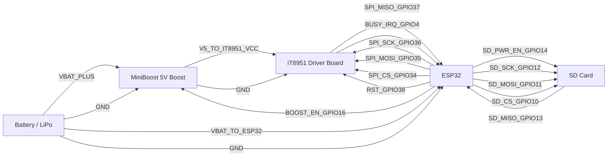
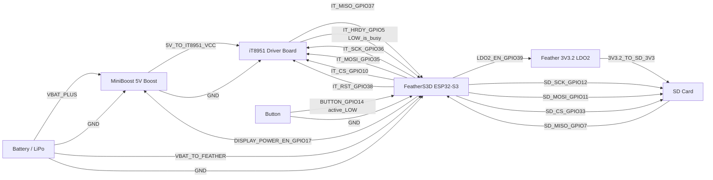

# Wiring

This project has a **single, canonical wiring diagram** below (rendered via **Mermaid** on GitHub). Edit the labels (GPIOs, connector pin names, wire colors) to match the physical build.

> Notes
> - GitHub renders Mermaid diagrams automatically.
> - In VS Code, Mermaid preview depends on your Markdown/Mermaid extensions.
> - This is a *wiring diagram* (connections + labels), not a symbol-accurate electronics schematic.

## Canonical Wiring Diagram (esp32s2-photoframe-it8951)

## FeatherS3D wiring

This section documents the wiring assumed by the `feathers3d` build target.

Source of truth in code: `src/boards/feathers3d/board_overrides.h`.

Key differences vs the esp32s2 board:
- SD uses a **separate SPI bus** (different SCK/MOSI/MISO) to avoid IT8951 loading issues.
- SD chip-select and power-enable pins differ.
- IT8951 chip-select differs.
- Display power enable (boost EN) differs.

### FeatherS3D wiring diagram

### Module pin mappings

These tables map each module's labeled pins to the FeatherS3D pins/GPIOs used by the `feathers3d` target.

#### Battery LiPo

| Module | Module pin label | Connects to FeatherS3D | Also connects to | Notes |
|---|---|---|---|---|
| LiPo battery | + / VBAT | BAT / VBAT input | Boost VIN | Shared battery feed |
| LiPo battery | - / GND | GND | Boost GND, IT8951 GND, SD GND | Single common ground |

#### MiniBoost 5V boost converter

Pin order: VIN, GND, 5V, EN.

| Module | Module pin label | Connects to FeatherS3D | Feather GPIO | Notes |
|---|---|---|---:|---|
| MiniBoost 5V | VIN | BAT / VBAT input |  | From LiPo battery + |
| MiniBoost 5V | GND | GND |  | Common ground |
| MiniBoost 5V | 5V | Not to Feather |  | Route to IT8951 5V |
| MiniBoost 5V | EN | GPIO17 | 17 | `DISPLAY_POWER_EN_PIN` HIGH enables 5V rail |

#### iT8951 driver board

Pin order: 5V, GND, MISO, MOSI, SCK, CS, RST, HRDY.

| Module | Module pin label | Connects to FeatherS3D | Feather GPIO | Notes |
|---|---|---|---:|---|
| IT8951 | 5V | Boost 5V |  | IT8951 requires 5V rail |
| IT8951 | GND | GND |  | Common ground |
| IT8951 | MISO | MISO | 37 | `IT8951_MISO_PIN` |
| IT8951 | MOSI | MOSI | 35 | `IT8951_MOSI_PIN` |
| IT8951 | SCK | SCK | 36 | `IT8951_SCK_PIN` |
| IT8951 | CS | CS | 10 | `IT8951_CS_PIN` |
| IT8951 | RST | IO | 38 | `IT8951_RST_PIN` |
| IT8951 | HRDY | IO | 5 | `IT8951_BUSY_PIN` wired to HRDY; LOW means busy |

#### SD card socket / breakout

Pin order: GND, 3V3, 5V, CS, MOSI, SCK, MISO, GND.

| Module | Module pin label | Connects to FeatherS3D | Feather GPIO | Notes |
|---|---|---|---:|---|
| SD module | GND | GND |  | Common ground |
| SD module | 3V3 | 3V3.2 pin |  | SD 3V3 is fed from Feather pin 3V3.2 (LDO2 output) |
| SD module | 5V not used | Not connected |  | Leave unconnected |
| SD module | CS | CS | 33 | `SD_CS_PIN` |
| SD module | MOSI | MOSI | 11 | `SD_MOSI_PIN` |
| SD module | SCK | SCK | 12 | `SD_SCK_PIN` (separate bus; do not share with IT8951) |
| SD module | MISO | MISO | 7 | `SD_MISO_PIN` |
| SD module | GND | GND |  | Second ground pin |

`SD_POWER_PIN` is set to GPIO39 on this board. Firmware drives GPIO39 HIGH before SD init, which enables the on-board LDO2 and powers the Feather 3V3.2 pin.

#### Button

| Module | Module pin label | Connects to FeatherS3D | Feather GPIO | Notes |
|---|---|---|---:|---|
| Button | One side | GPIO14 | 14 | `BUTTON_PIN` (active LOW; normally-open to GND) |
| Button | Other side | GND |  | |

### FeatherS3D signal mapping

| Subsystem | Signal | FeatherS3D GPIO | Notes |
|---|---|---:|---|
| Display power | Boost enable | 17 | `DISPLAY_POWER_EN_PIN` (HIGH = on) |
| IT8951 (SPI) | SCK | 36 | `IT8951_SCK_PIN` |
| IT8951 (SPI) | MOSI | 35 | `IT8951_MOSI_PIN` |
| IT8951 (SPI) | MISO | 37 | `IT8951_MISO_PIN` |
| IT8951 (SPI) | CS | 10 | `IT8951_CS_PIN` |
| IT8951 | RST | 38 | `IT8951_RST_PIN` |
| IT8951 | HRDY | 5 | `IT8951_BUSY_PIN` wired to HRDY (LOW = busy) |
| SD (SPI) | SCK | 12 | `SD_SCK_PIN` (separate bus; do not share with IT8951) |
| SD (SPI) | MOSI | 11 | `SD_MOSI_PIN` |
| SD (SPI) | MISO | 7 | `SD_MISO_PIN` |
| SD | CS | 33 | `SD_CS_PIN` |
| SD power | Power enable | 39 | `SD_POWER_PIN` (Feather LDO2 enable; HIGH = on) |
| Input | Button | 14 | `BUTTON_PIN` (active LOW; wire normally-open to GND) |
| Power (on-board) | MAX17048 I2C SDA/SCL | 8 / 9 | Built-in fuel gauge wiring on FeatherS3D |
| Power (on-board) | MAX17048 INT | 2 | Optional alert pin |
| USB power detect | VBUS sense | 34 | `VBUS_SENSE_PIN` (active HIGH) |

