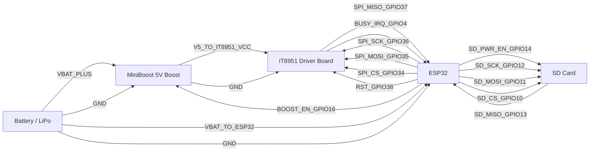
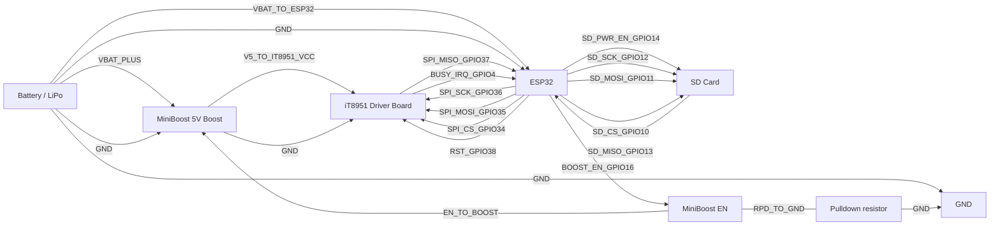

# Wiring

This project has a **single, canonical wiring diagram** below (rendered via **Mermaid** on GitHub). Edit the labels (GPIOs, connector pin names, wire colors) to match the physical build.

> Notes
> - GitHub renders Mermaid diagrams automatically.
> - In VS Code, Mermaid preview depends on your Markdown/Mermaid extensions.
> - This is a *wiring diagram* (connections + labels), not a symbol-accurate electronics schematic.

## Canonical Wiring Diagram



## Canonical Wiring Diagram (With BOOST_EN Pull-Down)

This is the same wiring as the canonical diagram above, with one extra component: a **pull-down resistor** from the MiniBoost enable line to GND so the boost stays off until firmware drives `GPIO16` HIGH.



- Typical values: `100k` (weak) to `10k` (stronger). Start with `100k` unless you have noise/EMI issues.
- Place the resistor physically close to the MiniBoost EN pin if possible.

## How to Update This Diagram

- Prefer updating **this diagram first** when you change wiring.
- Use the same names as the firmware (e.g., “BUSY”, “CS”, “RST”), and include the **GPIO number**.
- If you have consistent wire colors, append them to labels (example: `SPI SCK (GPIO18, green)`).

## Optional: Embed a Photo or Real Schematic

Markdown also supports embedding images. If you export a diagram from KiCad / EasyEDA / draw.io, add it like this:

```md

```

If you want to go this route, I recommend committing an **SVG** (crisp in GitHub) plus the original source file (e.g., `.kicad_sch` or `.drawio`).
